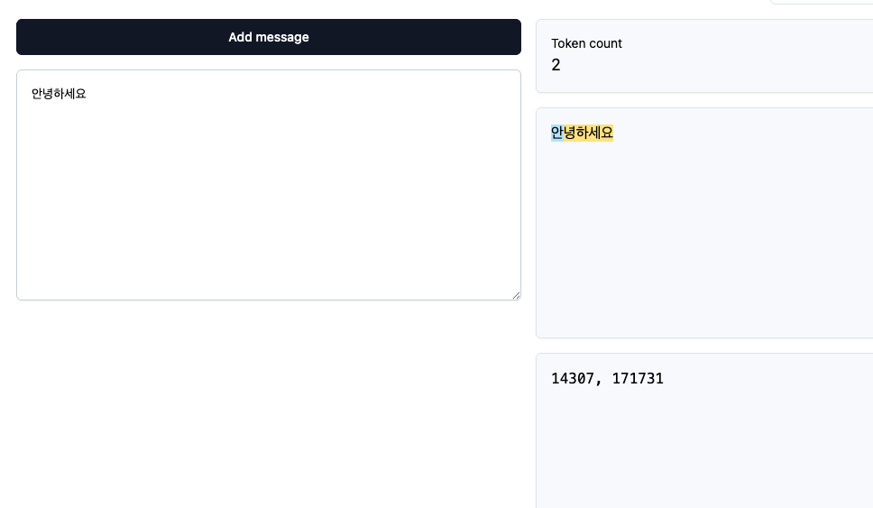
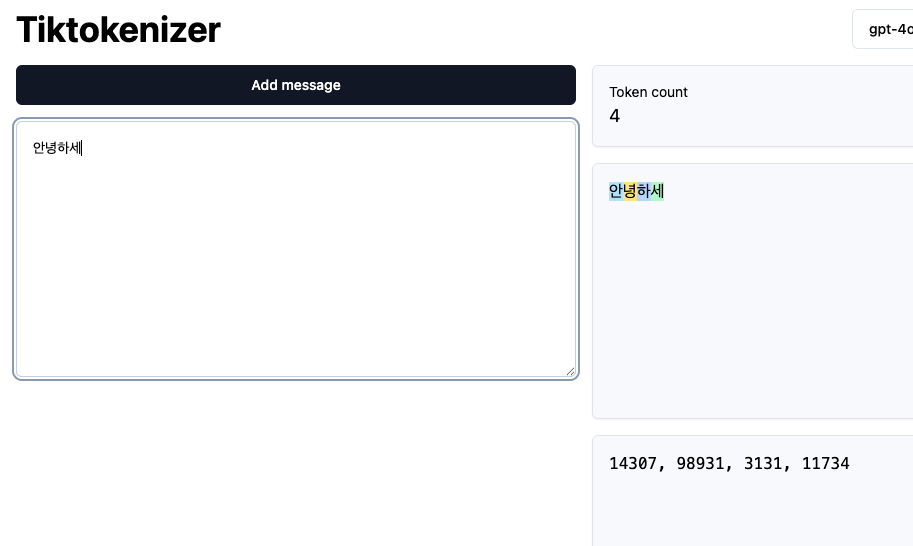
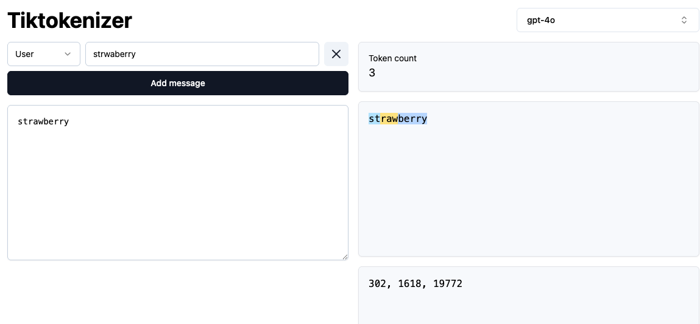
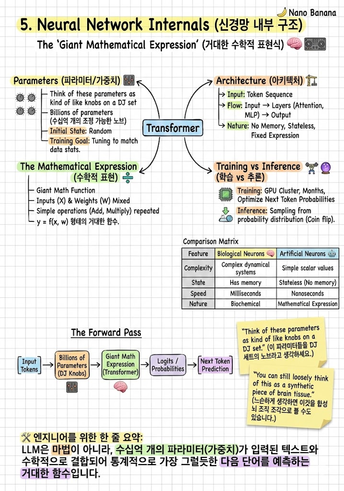

# 사전학습 데이터 (01)

## FineWeb, 데이터셋

허깅페이스 = AI의 깃허브

`FineWeb`이라는 데이터셋을 수집하고 만듦  
이건 LLM 학습앵 대규모 데이터셋임

주요 LLM 제공업체들은 내부적으로 FineWeb과 비슷한 데이터셋을 가지고 있을 것

엄청난 양의 텍스트가 필요함 + 고품질이면서 다양했으면 좋겠어
왜?? 모델안에 많은 지식을 담고 싶기 때문

FineWeb 데이터셋은 프로덕션급 애플리케이션에서도 잘 사용함
44TB인데, 생각보다 안큼

인터넷은 매우 방대하지만, 그렇게까지 엄청난 데이터는 아님  
우린 텍스트를 다루고, 공격적으로 필터링하기 때문에.

## 데이터는 어디서 오는가?

대부분은 `Common Crawl` 데이터를 사용 함

2007년부터 인터넷을 수집해온 조직으로, 2024년 기준 27억 개의 웹페이지를 색인함  
이들도 필터링을 적용함 (인터넷에는 쓰래기 데이터들이 너무나 많으니까)

1. URL 필터링
    - 데이터를 얻고 싶지 않은 URL이나 도메인 목록을 의미
    - 악성코드, 스팸, 마케팅, 성인 등..
2. 텍스트 추출
    - HTML 전체를 긁어오는것이 아니라 텍스트만 적절히 파싱해 처리함
3. 언어 필터링
    - 스페인어를 모두 필터링하면, 그 모델은 스페인어를 잘 못할 것임
4. 중복 제거 및 PII 제거
    - PII(Personally identifiable information)

# 토큰화 (02)

Token - 텍스트의 기본 단위, LLM이 처리하는 기호
Vocabulary - 가능한 모든 토큰의 집합, GPT-4는 10만개정도 보유

시퀀스 길이와 어휘 크기의 트레이드오프
적은 기호와 긴 시퀀스보다, 많은 기호와 짧은 시퀀스가 효율적

`기호(symbol)`는 사람이 보는 문자(알파벳) 같은 게 아니라, 신경망이 입력으로 받는 `원자 단위 ID`
엄밀하지는 않지만, 토큰과 동일한 의미로 생각해도 괜찮아 보임

"hello world" → [15339, 1917]
이때 [15339, 1917] 이게 시퀀스고, 모델은 이걸 1차원 배열처럼 입력으로 받는다는 뜻

기호는 많고, 시퀀스가 적은게 더 효율적이야
왜?? LLM은 시퀀스 길이(토큰 수)에 비례해서 연산량이 증가하기 때문임

따라서 우리는 기호 수를 늘려, 시퀀스 길이를 줄이는 방식을 사용함

시퀀스 길이를 어떻게 줄임?
우리는 BPE(Byte Pair Encoding)을 사용

예를 들어 116 다음에 32가 오는 시퀀스가 빈번하다면, 이 쌍을 새 기호로 그룹화 함

시퀀스에서
•    [116, 32] 가 자주 등장하면
• 이 둘을 묶어서 새로운 기호 256을 만들고
• 앞으로는 [116, 32] 대신 [256] 으로 표현

결과적으로 시퀀스 길이는 줄고, 대신 기호 종류(어휘)는 늘어나는 구조
10만개 정도의 기호가 성능 괜찮다고함, 그래서 GPT4도 기호 수가 10만개

이걸보면 안,녕,하,세 4개의 토큰에서
안, 녕하세요 2개의 토큰으로 변화하는 것을 볼 수 있음

통계적으로 `녕하세요`의 조합이 잦았다는 의미

비슷한 논리로, strawberry 에서 r이 몇인지 모델은 정확히 아는게 어려웠음

LLM은 하나의 단어가 아닌 여러개의 토큰으로 인식하기 때문  
따라서 `Python 이라는 도구를 통해서 strawberry에 r이 몇개있는지 확인해줘`같은 도구를 사용하는것이 나을 수 있음

## 신경망 입출력 (04)

- 컨텍스트 윈도우(Context Window)란?

모델이 “한 번에 보고 생각할 수 있는 입력 토큰의 최대 길이”를 의미
• 예: 최대 8000 토큰 모델이면
• 입력으로 최대 8000개 토큰까지만 넣을 수 있음
• 이 윈도우 안에 있는 토큰들이 모델 입장에선 현재까지의 문맥(context) 이 됨

왜 제한이 있냐?

Transformer는 토큰 수가 늘면 계산량이 O(N²) 로 폭발하기 때문에
무한히 길게 못 보고, 일정 길이에서 자르는 거야.

문장이 토큰으로 이렇게 있다고 치면
[A, B, C, D, E, F]

윈도우가 4라면 모델이 보는 건
•    [A, B, C, D] 보고 다음을 예측
•    [B, C, D, E] 보고 다음을 예측

따라서, 컨텍스트 윈도우를 벗어나면 LLM은 앞 부분을 못 봄

- 레이블(Label)이란?
  모델이 맞춰야 하는 정답 토큰

LLM 학습은 기본적으로 다음 토큰 맞추기 문제라서:
• 입력(컨텍스트): [A, B, C, D]
• 정답(레이블): E

즉, 모델이 [A,B,C,D]를 보고 다음이 E가 나오도록 확률을 높이는 학습을 한다는 뜻이야.

- 파라미터 = 모델의 기억/지식 저장소

LLM이 학습하면서
• “이 단어 다음엔 이 단어가 자주 온다”
• “이런 문맥이면 이런 답이 맞다”

같은 패턴을 수많은 숫자 값으로 저장하는데
그 숫자들이 전부 파라미터

입력은 가변 길이의 토큰 시퀀스, 0에서 8,000 같은 크기를 가짐
출력은 다음에 무엇이 오는지에 대한 예측, 우리 어휘에 10만개의 가능한 토큰이 있으므로, 신경만은 정확히 그만큼의 숫자를 출력할 것이고,
그 모든 숫자는 그 토큰이 스퀀스에서 다음으로 올 확률을 의미함

처음에는 무작위 예측을 하지만, 훈련 과정에서 정답 토큰의 확률을 높이고 다른 토큰의 확률을 낮추도록 신경망의 파라미터를 점진적으로 조정

## 신경망 내부 구조 (05)

신경망은 수십억 개의 파라미터(가중치)로 구성되며, 이 파라미터들이 입력 토큰과 수학적으로 결합되어 다음 토큰을 예측합니다.
파라미터는 처음에 무작위로 설정되지만, 훈련을 통해 훈련 데이터의 패턴과 일치하는 예측을 하도록 조정됩니다.
트랜스포머는 어텐션, MLP 블록 등의 레이어로 구성된 고정된 수학적 함수입니다.

파라미터들을 처음에는 무작위로 설정 -> 신경망이 무작위 예측
하지만 반복적으로 업데이트하는 과정을 통해, 파라미터들의 설정이 조정됨, 이걸 신경망 훈련이라 함

#### 파라미터(가중치): 신경망을 구성하는 조절 가능한 숫자들로, 현대 모델은 수십억~수조 개 보유

#### 트랜스포머(Transformer): 현대 LLM의 핵심 아키텍처로, 어텐션과 MLP 블록으로 구성

#### 어텐션(Attention): 입력 토큰들 간의 관계를 학습하는 트랜스포머의 핵심 메커니즘

입력 토큰들 간의 관계를 보기 때문에, 입력 토큰의 길이에 제곱 O(N^2)

1:1,1:2,1:3....
2:1,2:2,2:3....

이중 for문을 쓰는 느낌으로 자기 자신과의 관계도 확인함

#### MLP(Multi-Layer Perceptron): 정보를 처리하는 피드포워드 신경망 블록, Perceptron -> 뉴런을 모방한 신경망 모델

#### 임베딩(Embedding): 토큰을 신경망 내부에서 표현하는 벡터 (벡터 -> 숫자 배열)

가능한 모든 토큰들은 신경망 내부에서 그것을 나타내는 벡터를 가지고 있음
대부분의 상황에서는 결정론적임, 왜?

임베딩은 보통 그냥 Embedding Matrix(거대한 테이블) 에서, 토큰 ID를 인덱스로 써서, 해당 행(row)을 꺼내오는 방식

임베딩 벡터의 각 숫자 하나하나는 “명확한 의미(예: 1번째는 감정, 2번째는 동물성)” 이런 식으로 해석되지 않아.
대신 전체 벡터가 “의미를 좌표로 표현한 것” 이라고 보면 돼.

	•	"cat" → (4096차원 공간의 어떤 위치)
	•	"dog" → (그 근처 위치)

그래서 숫자 배열은 사실상
그 토큰이 의미 공간에서 어디 위치하는지 나타내는 좌표

`각 숫자는 해석하기 어렵고, 관계가 중요함`

예를 들어 "king" 임베딩이 [0.1, -0.2, ...] 라고 해도
• 0.1이 “왕의 힘”
• -0.2가 “남성성”

이런 식으로 딱 떨어지게 해석되진 않아.

대신 중요한 건:
• king과 queen 벡터는 비슷한 방향/거리
• king과 car 벡터는 멀다

이런 거리/각도(유사도) 가 의미를 만든다.

#### 고정된 수학적 함수: 상태나 기억 없이 입력에서 출력으로 변환하는 결정론적 표현식

## 추론 (06)

핵심 개념

#### 추론(Inference): 훈련된 모델로 새로운 데이터를 생성하는 과정

#### 접두사(Prefix): 텍스트 생성을 시작하기 위한 초기 토큰 시퀀스

#### 샘플링: 확률 분포에서 다음 토큰을 무작위로 선택하는 과정

#### 확률적 생성: 높은 확률의 토큰이 더 자주 선택되지만 결과는 매번 다름

#### 자기회귀(Autoregressive): 생성된 토큰을 다시 입력에 추가하여 다음 토큰을 예측

#### loss(손실): 모델의 예측 성능을 나타내는 지표로, 낮을수록 좋음

Meta의 Llama 3.1 베이스 모델을 통해 사전학습만 완료된 모델의 특성을 보여줍니다.
베이스 모델은 "인터넷 텍스트 시뮬레이터"로, 질문에 답하는 어시스턴트가 아니라 인터넷 문서를 완성하는 문서 완성기입니다.
질문을 입력하면 답변 대신 비슷한 질문을 더 생성하거나, 인터넷에서 볼 법한 다른 패턴으로 텍스트를 완성합니다.
ChatGPT 같은 대화형 어시스턴트가 되려면 후속 학습(파인튜닝)이 필요합니다.

#### 베이스 모델(Base Model): 인터넷 데이터로 사전학습만 완료된 상태의 모델

#### 인터넷 텍스트 시뮬레이터: 베이스 모델의 본질로, 인터넷에서 본 패턴을 모방

#### 문서 완성기: 질문에 답하는 것이 아니라 입력된 텍스트를 자연스럽게 이어가는 역할

#### 파인튜닝(Fine-tuning): 베이스 모델을 특정 용도(예: 어시스턴트)에 맞게 추가 학습

베이스 모델은 쉽게 말해서 인터넷에서 긁어온 엄청난 텍스트를 보고 “다음 단어(토큰)가 뭐가 올지 맞추는 훈련만” 한 모델

ChatGPT는 베이스 모델에서 끝난 게 아니라 추가로
• “질문이 오면 답을 해야 한다”
• “안전하게 말해야 한다”
• “명확하게 요약해야 한다”
• “사용자에게 도움이 되어야 한다”

이런 규칙을 따르도록 후속 학습을 시킴.

사전학습으로 만들어진 베이스 모델은 인터넷 문서를 시뮬레이션할 뿐, 사용자의 질문에 직접 답변하지 못합니다.
후속학습 단계에서 이 베이스 모델을 대화가 가능한 어시스턴트로 변환합니다.
ChatGPT 같은 대화형 AI를 만드는 핵심 과정으로, 계산 비용은 사전학습보다 훨씬 적지만 모델의 실용성을 결정짓는 중요한 단계입니다.

#### 베이스 모델(Base Model): 인터넷 텍스트에서 사전학습된 모델로, 문서를 시뮬레이션할 수 있지만 직접 대화는 불가능

#### 후속학습(Post-Training): 베이스 모델을 어시스턴트로 변환하는 추가 학습 단계

#### 어시스턴트 페르소나: 질문에 답하고 사용자와 대화할 수 있는 AI의 성격

#### 계산 효율성: 후속학습은 사전학습 대비 훨씬 적은 계산 자원으로 수행 가능

지도학습 미세조정(SFT)의 핵심은 대화 데이터셋입니다.
인간 라벨러가 수십만 개의 고품질 대화를 작성하고, 회사가 제공한 라벨링 지침에 따라 이상적인 어시스턴트 응답을 만듭니다.
모델은 이 대화들의 통계적 패턴을 학습하여 "도움이 되고, 진실되고, 해롭지 않은" 어시스턴트의 페르소나를 갖게 됩니다.
ChatGPT와 대화할 때 받는 응답은 이 인간 라벨러들의 통계적 모방이라고 볼 수 있습니다.

#### SFT(Supervised Fine-Tuning, 지도미세조정) 데이터셋: 인간 라벨러가 작성한 수십만 개의 대화 예시 모음

#### 라벨링 지침: 이상적인 어시스턴트 응답을 정의하는 회사의 가이드라인 (도움, 진실성, 무해함)

#### 대화 토큰화: 대화를 특수 토큰(im_start, im_end 등)을 사용해 1차원 토큰 시퀀스로 변환

#### 합성 데이터: 현대 스택에서는 LLM이 데이터셋 생성을 돕고 인간이 편집하는 방식으로 발전

#### 통계적 모방: ChatGPT 응답은 학습 데이터의 인간 라벨러를 통계적으로 시뮬레이션한 결과

어시스던트가 특정한 성격을 가질 수 있음, 실제로 여러 곳에서 지원하기도 하고
우리는 코드를 작성하여 신경망을 프로그래밍 하지않음, 모든 것은 데이터셋에서의 학습을 통해 이루어짐

인간 라벨러에게 대화 맥락을 제공하고, 이 상황에서 이상적인 어시스턴트 응답을 작성 함
그런 다음 모델이 이것을 학습하고, 모방하도록 함

예를 들어 ChatGPT에 가서 "파리에서 봐야 할 상위 5개 랜드마크를 추천해줘"라고 말하고 엔터를 치면 여기서 나오는 것은 어떻게 생각해야 할까요?
나가서 모든 랜드마크를 조사하고 무한한 지능으로 순위를 매긴 마법 같은 AI가 아닙니다.
얻는 것은 OpenAI가 고용한 라벨러의 통계적 시뮬레이션입니다.  
이 특정 질문이 OpenAI의 후속학습 데이터셋에 어딘가에 있다면, 인간 라벨러가 그 다섯 랜드마크에 대해 적었을 것과 매우 유사한 답을 볼 가능성이 높습니다.
인간 라벨러가 이것을 어떻게 만들까요? 나가서 인터넷에서 20분 동안 자체 조사를 하고 목록을 만듭니다.
이 목록을 만들어 데이터셋에 있으면, 어시스턴트의 정답으로 제출한 것을 볼 가능성이 매우 높습니다.

후속학습 데이터셋과 결합된 사전학습 지식이 이런 종류의 모방을 만들어냅니다.

SSL 방식도 존재함
Self Supervised-Learning

데이터 학습 시킬 때 GT(Ground Truth) Annotation 없는 것 넣고
마스킹처리 해서 간적접으로 정답을 제공하는 방식

그렇게 해서 정답값없이 스스로 학습을 시킴

Annotation = 정답값 라벨링 한 것

## 환각 (07)

LLM은 학습 데이터에서 "자신있게 답하는" 패턴을 배웠기 때문에, 모르는 것도 확신있게 답하는 환각(hallucination) 문제가 발생합니다.
이를 완화하기 위해 두 가지 방법이 사용됩니다.

첫째, 모델을 심문하여 무엇을 모르는지 파악하고 "모르겠습니다"라고 답하도록 학습시킵니다.
둘째, 웹 검색이나 코드 실행 같은 도구를 사용하여 외부 정보를 컨텍스트 윈도우(작업 메모리)에 가져와 정확한 답변을 생성합니다.

#### 환각(Hallucination): 모델이 모르는 정보를 자신있게 지어내는 현상

#### 지식 기반 거부: 모델이 모르는 것에 대해 "모르겠습니다"라고 답하도록 학습

#### 도구 사용(Tool Use): 웹 검색, 코드 실행 등 외부 도구를 호출하는 특수 토큰 메커니즘

#### 지식 메모리: 파라미터에 저장된 희미한 기억 (사전학습에서 습득)

#### 작업 메모리: 컨텍스트 윈도우에 있는 직접 접근 가능한 데이터

인간이 어시스턴트의 정답을 작성할 때, 인간이 이 사람이 누군지 알거나 인터넷에서 조사하고 와서 이런 확신 있는 톤의 응답을 작성합니다.

예를 들어, 톰 크루즈가 누구냐, 톰 크루즈는 유명한 미국 배우이고 프로듀서입니다.
존 바라소가 누구냐, 미국 상원의원입니다.
칭기즈 칸이 누구냐, 칭기즈 칸은 어쩌고저쩌고였습니다.

모델이 통계적으로 학습 세트를 모방하기 때문에, `이 사람이 누군지 모르겠습니다.` 라고 말하는 것은 일어나지 않음

그래서 이것을 어떻게 고칠까요?

1. 분명히 데이터셋에 어시스턴트의 정답이 모델이 모른다는 것인 예시가 필요합니다.
   하지만 그 답이 모델이 실제로 모르는 경우에만 나오도록 해야 합니다.
   그래서 질문은 모델이 무엇을 알고 모르는지 어떻게 아느냐는 것입니다.

-> 우리는 이것을 경험적으로 모델을 조사해서 알아낼 수 있습니다.
예를 들어 Meta가 Llama 3 시리즈 모델에서 환각을 어떻게 다루었는지 살펴봅시다.
기본적으로 모델을 심문해서 무엇을 알고 모르는지, 파악하는 절차를 설명합니다.
그런 다음 모델이 모르는 것에 대해 정답이 모델이 모른다는 것인 예시를 학습 세트에 추가합니다.

쉽게말하면 그냥 계속 물어보고 실제와 비교하여, 답을 못하는 부분에 대해 `모르겠습니다`라는 응답 학습을 추가하는 것

2. 새 토큰을 도입하는 것, search_start 같은 것 추가
   이걸로 Google 같은곳에 검색을 하는 것, 그리고 모든 텍스트를 가져 옴
   이걸 컨텍스트 윈도우 (모델의 작업 메모리)에 올려서 참조할 것

## 자기 인식 (08)

LLM에게 "너 누구야?"라고 묻는 것은 실제로 의미가 없습니다. 모델은 지속적인 자아가 없으며, 매 대화마다 처음부터 시작됩니다.
모델이 자신에 대해 답하는 내용은 학습 데이터에서 온 통계적 추측이거나, 개발자가 의도적으로 프로그래밍한 것입니다. 자기 정체성은 하드코딩된 대화 예시나 시스템 프롬프트를 통해 부여됩니다.

#### 지속적 자아 부재: LLM은 대화마다 새로 시작되며 연속적인 정체성이 없음

#### 자기 정체성 환각: 명시적으로 학습되지 않으면 모델은 자신에 대해 추측하여 답함 (예: "OpenAI가 만들었다")

#### 하드코딩된 대화: "당신은 누구입니까?" 같은 질문에 대한 정해진 답을 학습 데이터에 포함

#### 시스템 프롬프트: 대화 시작 시 숨겨진 메시지로 모델에게 정체성 정보 제공

#### 덧붙여진 정체성: 모델의 자기 인식은 인간처럼 깊이 있는 것이 아니라 표면적으로 추가된 것

여기 "olmo2 hardcoded"가 있습니다. 거기 가면 240개의 대화가 있고, 이 240개의 대화를 보세요.
하드코딩되어 있습니다. "자신에 대해 말해줘"라고 사용자가 말하면 어시스턴트가
"저는 Allen Institute for Artificial Intelligence의 AI to에서 개발한 오픈 언어 모델입니다" 등.
"도와드리겠습니다" 어쩌고저쩌고. "이름이 뭐야?" OLMo 프로젝트.
이것들은 모두 OLMo 2에 대한 이런 종류의 준비된 하드코딩된 질문들과 이런 경우에 줄 정답들입니다.
이런 질문이나 대화 240개를 학습 세트에 넣고 파인튜닝하면, 모델이 실제로 나중에 이것을 앵무새처럼 반복할 것으로 예상됩니다.
이것을 주지 않으면 아마 OpenAI의 ChatGPT라고 할 것입니다.

왜?? 이런 종류의 질문에 답하도록 모델을 명시적으로 프로그래밍하지 않으면, 얻는 것은 답에 대한 통계적 최선의 추측이기 때문입니다.
즉 ChatGPT가 가장 유명하고 데이터가 많으니까, 통계적으로 선택될 가능성이 있다는 것

## 강화학습 (09)

Pre-Training -> Post-Training(SFT) -> RL(Reinforcement Learning)

1. 사전학습 단계에서, 인터넷 문서에 대해서 학습함, 이걸 기반으로 베이스 모델을 구축
2. 베이스 모델은 사용자의 질문에 답하는 방식에 익숙하지 않음, 인터넷 문서 시뮬레이터의 느낌
3. 후속학습을 통해서 지도학습 미세조정을 함, 인터넷 문서 대신 대화에 대한 데이터셋을 만들고 학습함 (인간 라벨러가 질문과 응답을 작성함)
4. 여기서 더욱 나아가, 인간이 답을 알려주는 대신, 모델이 스스로 다양한 풀이를 시도하고 정답에 도달하자 -> Reinforcement Learning

#### 시행착오 학습: 하나의 문제에 수천 개의 풀이를 시도하고, 정답에 도달한 풀이를 강화하는 방식

#### 보상 함수(Reward Function): 풀이가 얼마나 좋은지 점수를 매기는 함수로, 검증 가능한 영역에서는 자동화 가능

#### 자기 발견(Self-Discovery): 모델이 인간이 알려주지 않은 문제 해결 전략을 스스로 발견

#### SFT의 한계: 지도학습 미세조정은 인간 전문가를 모방할 뿐, 인간의 인지 방식이 LLM에게 최적이 아닐 수 있음

에밀리는 사과 3개와 오렌지 2개를 삽니다. 각 오렌지는 2달러이고, 모든 과일의 총 가격은 13달러입니다. 사과 하나의 가격은 얼마일까요?

3이라는 정답에 도달하기 까지 여러개의 방법이 존재
계산을 건너뛰어 바로 답에 도달할 수 있고, 방정식을 세울 수 있고, 설명하며 푸는 방법도 있을 수 있다.

인간 라벨러는 어떤 방식을 접근하여 LLM을 학습시켜야 할까?
인간은 LLM이 아니기 때문에, 무엇이 LLM에게 좋은 방법일지 모르고 우리에게 쉬운것이 LLM에게는 어려운 것 일수 있음 (strawberry 문제처럼)

따라서 강화학습을 시도하는 것

아래는 RMHF (Reinforcement Human Feedback)
나온지 2년정도된 최신기술이며, 현재는 표준처럼 자리잡고 있다고 함

1. 모델이 답변 여러 개 생성

예를 들어 질문이: “JWT랑 Session 차이 설명해줘”

모델이 답변을 4개 만든다고 치자.

A안, B안, C안, D안

⸻

2. 사람이 랭킹을 매김

사람이 보고:
• B가 제일 좋다
• 그 다음 A
• 그 다음 D
• 최악은 C

이런 식으로 순위를 매겨.

여기서 중요한 건
사람이 “정답”을 직접 쓰는 게 아니라, 상대적으로 평가만 한다는 점임.

3. Reward Model(보상 모델)을 학습

이제 사람 평가 데이터를 이용해서

“이 답변이 인간이 좋아할 답변인지 점수로 예측하는 모델”

즉 Reward Model을 따로 만듦.

Reward Model은 이렇게 동작해:
• 입력: 질문 + 답변
• 출력: 점수 (예: 0.73)

⸻

4. 이제 RL은 “Reward Model”을 기준으로 학습

이제부터는 사람 없어도 됨.

모델이 답변을 만들면 Reward Model이 점수를 주고,
그 점수를 최대화하도록 파라미터를 업데이트해.

즉 RL 단계에서 모델이 보는 정답은:

“사람이 만든 Reward Model이 높은 점수를 주는 답변”, 이게 정답 역할

## 앞으로의 전망 (10)

#### 멀티모달: 이미지, 오디오, 비디오

오디오와 이미지를 처리하고싶으면?? 오디오와 이미지를 토큰화하고 위에서 이야기한 것과 정확히 같은 접근법을 적용할 수 있기 때문입니다. 
예를 들어 오디오를 토큰화하기 위해 오디오 신호의 스펙트로그램 조각을 보고 토큰화하고, 오디오를 나타내는 토큰을 더 추가하고 컨텍스트 윈도우에 넣고 훈련함 

오디오, 이미지, 텍스트를 나타내는 토큰 스트림을 만들고 그것들을 섞어서 단일 모델에서 동시에 처리할 수 있습니다. 이것이 멀티모달리티의 한 예입니다.

